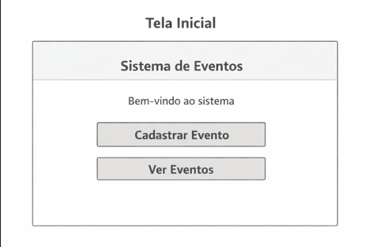
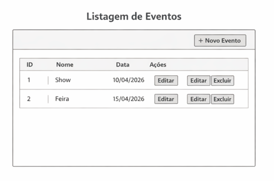
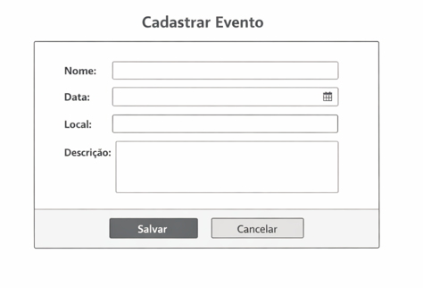
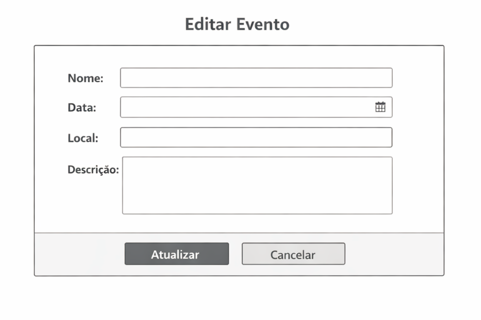

# Sistema de Gerenciamento de Eventos
## 📌 Descrição
Sistema desenvolvido para gerenciar eventos, permitindo cadastro, listagem, edição e remoção.

## 🚀 Tecnologias
- Java
- PostgreSQL

## 🧩 Classes

### Evento
Responsável por representar um evento com seus dados.

### GerenciadorEventos
Gerencia a lista de eventos e operações CRUD.

## 🗄️ Banco de Dados

Tabela: eventos

- id (PK)
- nome
- data
- local
- descricao

### Decisões:
- Uso de SERIAL para auto incremento
- VARCHAR para campos controlados
- Índice para melhorar busca

## 🎨 Wireframe
O sistema possui as seguintes telas:

Fluxo:
Usuário acessa → lista eventos → cadastra ou edita → salva
